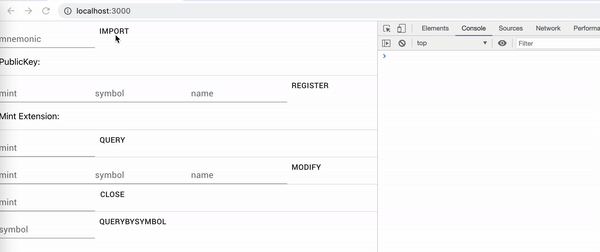

# DApp with MintRegistry

为了配合MintRegistry合约的使用，Solong团队开发了JavaScript库
[@solong/mintregistry.js](https://www.npmjs.com/package/@solong/mintregistry.js)
协助DApp来和合约进行交互。

## Demo
先来看一个Demo:

在Demo里面，首先通过onImport导入了一个助记词对应的账号，该账号已经发布了一个SPL币，
然后在随后的操作中，首先进行注册，注册后进行查询，可以再日志窗口中，看到查询的结果。
然后再行修改，修改后再查询，可以看到日志窗口中的记录已经变化了。

Demo地址：[mintregistry_dapp](https://github.com/solongwallet/mintregistry/tree/master/dapp/example/mintregistry_dapp)

## 1. 集成 @solong/mintregistry.js

@solong/mintregistry.js支持npm/yarn 进行安装：

    yarn add @solong/mintregistry.js
    npm install @solong/mintregistry.js
都可以将在npm发布的
[@solong/mintregistry.js](https://www.npmjs.com/package/@solong/mintregistry.js) 
集成到项目中。

## 2. 注册MintExtension
在注册MintExtension之前，我们需要创建一个用于存放MintExtension信息的Account,然后在调用
注册的Instruction来将信息进行写入

使用@solong/mintregistry.js中的MintRegistry提供的：

    /**
     * Regist an extension for Mint.
     *
     * @param connection The connection to use
     * @param payer Fee payer and mint maker for transaction
     * @param mint the mint 
     * @param symbol symbol for mint
     * @param name  name for mint
     * @param programID RegisterMint's address
     */
    static async RegisterMint(
        connection,
        payer,
        mint,
        symbol,
        name,
        programID,
    )

传入[solana-web3.js](https://github.com/solana-labs/solana-web3.js)中的Connection对象。
payer为mint币的“mint_authority”,同时也是铸币消耗SOL的账号，为
[solana-web3.js](https://github.com/solana-labs/solana-web3.js)的Account对象。

* symbol为要为mint币添加的symbol信息，一般是由大写的简写表示，比如“USDC”，“SRM”。
* name 为腰围mint币添加的name信息，如"Wrapped USDT"
* programID 为MintRegitry合约的地址，当前主网上的合约地址为
"FKNCdZBzWwX3oSek1ubTu1oFunj7MVCca5i8PDMD7LNi",在@solong/mintregistry.js也有导出：
    
    export const ProgramID = "FKNCdZBzWwX3oSek1ubTu1oFunj7MVCca5i8PDMD7LNi";

其中mint，programID都是[solana-web3.js](https://github.com/solana-labs/solana-web3.js)
中的PublicKey对象。

## 3. 查询

## 4. 修改
修改时，需要使用@solong/mintregistry.js中的MintRegistry提供的：

    /**
     * Modify an extension for Mint.
     *
     * @param connection The connection to use
     * @param payer Fee payer and mint maker for transaction
     * @param extAccount mint extension account 
     * @param mint the mint 
     * @param symbol symbol for mint
     * @param name  name for mint
     * @param programID RegisterMint's address
     */
    static async ModifyMint(
        connection,
        payer,
        extAccount,
        mint,
        symbol,
        name,
        programID,
    )

这里的参数和注册时基本一致，这里多出来的extAccount是PublicKey类型的上面注册返回的地址。
如果没有记录，可以通过查询接口得到。

## 5. 删除
如果想收回这里注册的MintExtension账号，需要用Mint的mint_authority账号调用
@solong/mintregistry.js中的MintRegistry提供的：

    /**
     * Close an extension for Mint.
     *
     * @param connection The connection to use
     * @param payer Fee payer and mint maker for transaction
     * @param extAccount mint extension account 
     * @param mint the mint 
     * @param programID RegisterMint's address
     */
    static async CloseMint(
        connection,
        payer,
        extAccount,
        mint,
        programID,
    )

这里参数也基本和之前的相同。只是少了symbol和name。

## 总结

@solong/mintregistry.js 提供了操作MintRegistry合约的所有接口，DApp开发者无需关心合约细节，
直接调用相关接口既可以完成Mint Name信息的添加、查询、修改、删除等操作。